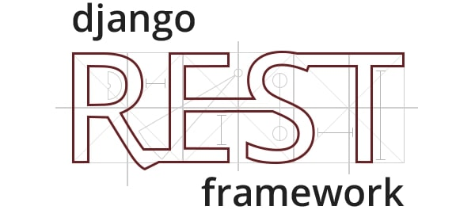

<p align="center">
    
</p>

# JWT Authentication in Django project

This repository is a minimal example of JWT authentication implementation in the Django REST framework.

## Technologies

 - Python 3
 - Django 5
 - Django REST Framework

## Getting started

Create a new Python virtual environment
```shell
python -m venv .venv
```

Activate the virtual environment
```shell
source .venv/bin/activate
```

Install required packages
```shell
python -m pip install -r requirements.txt
```

Run Django server
```shell
python manage.py runserver
```